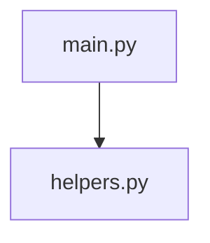

# Advanced Project Builder – Enhanced Edition

A powerful, extensible tool that extracts code blocks from Markdown/instruction files, reconstructs a complete project directory, analyzes dependencies, and optionally enhances the plan with LLM-generated metadata and missing files.

---

## 🚀 Features

- **Block Extraction** – Parses Markdown files for fenced code blocks with language hints and optional explicit paths.
- **Path Detection** – Automatically detects file paths from comments (e.g., `# path/to/file.py`).
- **Dependency Analysis** – Extracts imports/requires for multiple languages (Python, JavaScript, Go, Rust, Java, C/C++) and builds a dependency graph.
- **Intelligent Resolution** – Resolves relative and absolute imports to file paths using a pluggable resolver system.
- **Parallel Processing** – Speeds up extraction and analysis using thread pools.
- **LLM Integration** – (Optional) Uses Ollama to:
  - Detect project type and frameworks.
  - Identify entrypoints.
  - Suggest missing files (e.g., `requirements.txt`, `README.md`).
  - Generate content for missing files.
- **Rich Reporting**:
  - Mermaid dependency graph (`.mmd`)
  - Tree view of project structure (`tree.txt`)
  - HTML report with statistics and file listing
  - SBOM (Software Bill of Materials) in SPDX-like JSON format
- **Security** – Prevents path traversal attacks and validates output paths.
- **Caching & Retries** – Resolver caching and exponential backoff for LLM calls.
- **Dry‑Run** – Preview changes without writing to disk.

---

## 📦 Installation

### Prerequisites
- Python 3.9 or higher
- (Optional) [Ollama](https://ollama.ai/) with a model like `qwen2.5:7b` or `llama3`

### Steps

1. Clone the repository or save the script as `project_builder.py`.
2. Install required dependencies:
   ```bash
   pip install networkx ollama tomli  # tomli for Python < 3.11
   ```
3. (Optional) Install `tomli` if you are on Python < 3.11; otherwise, the standard `tomllib` is used.

---

## 🖥️ Usage

```bash
python project_builder.py --path <instruction.md> [OPTIONS]
```

### Command‑Line Options

| Option | Description |
|--------|-------------|
| `--path` | **Required.** Path to the instruction file (Markdown). |
| `--output-dir` | Output directory (default: `./extracted_project`). |
| `--ollama` | Enable LLM planning using Ollama. |
| `--ollama-model` | Ollama model name (default: `qwen2.5:7b`). |
| `--generate-missing` | Generate content for missing files (requires `--ollama`). |
| `--dry-run` | Preview actions without writing anything. |
| `--verbose` | Enable debug logging. |
| `--parallel` / `--no-parallel` | Enable/disable parallel processing (default: on). |
| `--export-mermaid` | Export dependency graph as `graph.mmd`. |
| `--export-tree` | Export directory tree as `tree.txt`. |
| `--html-report` | Generate an HTML report (default: on). |

### Quick Example

```bash
python project_builder.py --path instructions.md --ollama --generate-missing
```

This will:
- Parse `instructions.md`
- Extract code blocks
- Use Ollama to refine project metadata and generate missing files
- Write all files under `./extracted_project/`
- Save `project_plan.json`, `graph.mmd`, `tree.txt`, `report.html`, and `sbom.json`

---

## 📄 Input Format

The instruction file should be Markdown with fenced code blocks. Each block **must** have a language tag. Optionally, you can specify a file path in the info string:

<pre>
```python path/to/app.py
import flask

app = Flask(__name__)
...
```
</pre>

You may also embed the path inside a comment on the first few lines:

```python
# path/to/app.py
import flask
...
```

---

## 🧩 Outputs

| File | Description |
|------|-------------|
| `project_plan.json` | Metadata, file list (hashes, sizes, imports), dependency edges, circular dependencies, etc. |
| `graph.mmd` | Mermaid diagram of the dependency graph (if `--export-mermaid`). |
| `tree.txt` | ASCII directory tree (if `--export-tree`). |
| `report.html` | Visual HTML summary with statistics and file table. |
| `sbom.json` | Software Bill of Materials in SPDX-like format. |
| All source files | Reconstructed files under the output directory. |

---

## 🧠 LLM Integration (Ollama)

The tool can interact with a local LLM via Ollama to:

- **Refine project type and frameworks** – e.g., detects FastAPI, React, Django.
- **Identify entrypoints** – files like `main.py`, `app.js`.
- **List missing files** – suggests files that are typical for the project type.
- **Generate missing file content** – when `--generate-missing` is enabled.

**Configuration**:
- Set `--ollama-model` to change the model.
- Retry logic: 3 attempts with exponential backoff.
- Timeout: 30 seconds per call (configurable via `DEFAULT_CONFIG`).

---

## 🔧 Configuration

Modify the `DEFAULT_CONFIG` dictionary at the top of the script to adjust:

```python
DEFAULT_CONFIG = {
    'max_file_size_mb': 10,          # Truncate oversized files
    'max_project_files': 5000,       # Not yet enforced (planned)
    'parallel_workers': 4,           # Number of threads for processing
    'llm_max_retries': 3,
    'llm_timeout_seconds': 30,
    'enable_mermaid': True,
    'enable_tree': True,
    'enable_sbom': True,
    'enable_html_report': True,
}
```

---

## 🧩 Extending Import Resolvers

The `ImportResolver` class (in `ImportResolver`) supports adding custom resolvers for new languages. To add a new language, extend the `resolvers` dictionary with a callable that takes a module string and returns a resolved file path (or `None`).

```python
resolver = ImportResolver()
resolver.resolvers['my_lang'] = lambda mod: mod.replace('.', '/') + '.myext'
```

The resolver is used during block processing to populate `ImportInfo.resolved_path`.

---

## 🧪 Example

**Input (`instruction.md`)**:

````markdown
```python main.py
# main.py
import helpers

def main():
    helpers.greet()
```

```python helpers.py
def greet():
    print("Hello!")
```
````

**Run**:

```bash
python project_builder.py --path instruction.md
```

**Output**:
```
extracted_project/
├── main.py
├── helpers.py
├── project_plan.json
├── graph.mmd
├── tree.txt
├── report.html
└── sbom.json
```

**Dependency Graph** (`graph.mmd`):


---

## ⚙️ Requirements

### Core
- Python 3.9+
- Standard library (argparse, asyncio, hashlib, json, logging, re, time, pathlib, collections, enum, datetime, subprocess)

### Optional
- [networkx](https://networkx.org/) – for advanced graph analysis (circular dependency detection)
- [ollama](https://github.com/ollama/ollama-python) – for LLM integration
- [tomli](https://github.com/hukkin/tomli) – for TOML parsing (only needed on Python < 3.11)

All optional imports are gracefully handled – the tool falls back to a simplified dependency representation if `networkx` is missing.

---

## 🛡️ Security & Safety

- **Path Traversal** – All file paths are validated to ensure they stay within the output root directory.
- **Absolute Paths** – Rejected automatically.
- **Size Limits** – Files larger than `max_file_size_mb` are truncated.
- **Duplicate Paths** – Duplicate file paths are skipped with a warning.
- **Dry‑Run** – Preview changes without writing any files.

---

## 🐛 Troubleshooting

| Issue | Solution |
|-------|----------|
| `Ollama not available` | Install `ollama` with `pip install ollama` and ensure Ollama service is running. |
| `ModuleNotFoundError: No module named 'networkx'` | Install networkx or ignore – the tool will still work with basic dependency tracking. |
| LLM timeouts | Increase `llm_timeout_seconds` in `DEFAULT_CONFIG`. |
| Missing paths in blocks | Use explicit path in the code block info string or add a `# path/to/file` comment. |
| Circular dependencies | The tool logs them; you may need to refactor your code. |

---

## 🤝 Contributing

Contributions are welcome! Please open an issue or pull request with:

- Clear description of the change
- Tests (if applicable)
- Adherence to the existing code style (PEP 8)

---

## 📜 License

This project is released under the **MIT License**. Feel free to use, modify, and distribute.

---

## 🙏 Acknowledgements

- Built with Python’s asyncio and threading for high performance.
- Inspired by tools that convert LLM-generated code into runnable projects.
- Uses Ollama for local LLM capabilities.
